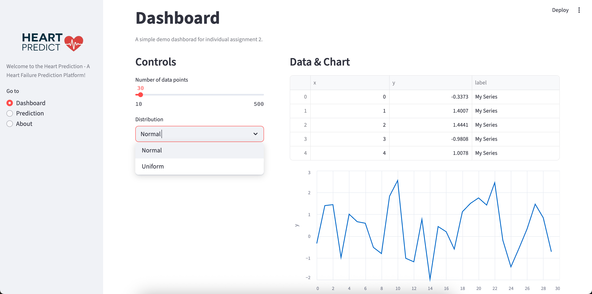
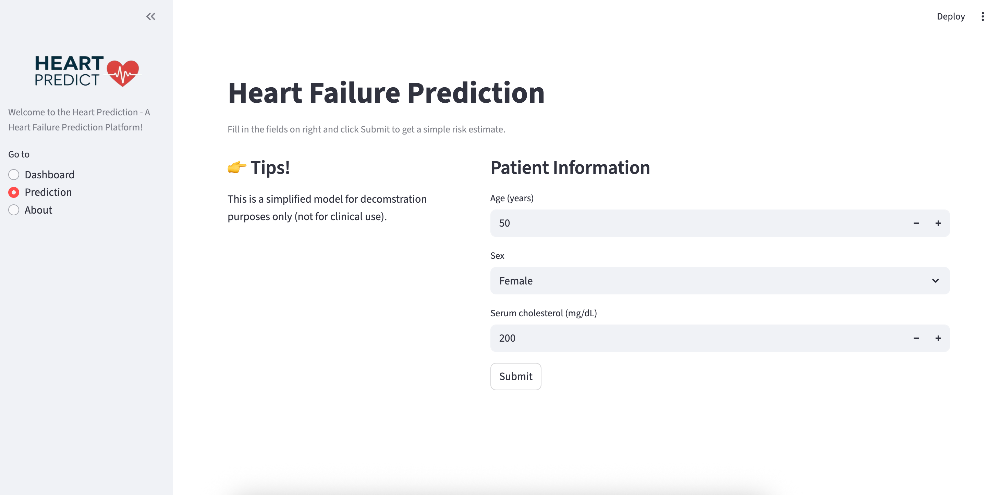
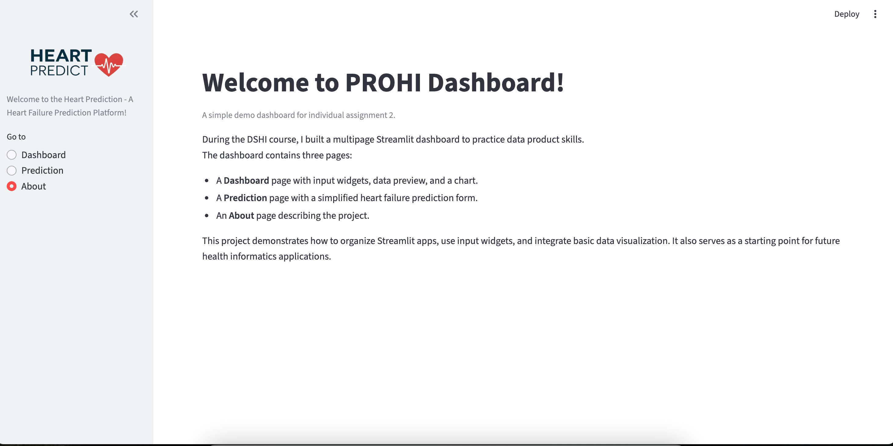

# PROHI Dashboard Example

**Author**: Xue WU
**Collaborator**: Huong Le

## Introduction

This repository contains a simple **multipage Streamlit web dashboard** developed as part of the DSHI course individual assignment.  
The app demonstrates how to build interactive dashboards with basic input widgets, data tables, and visualizations.

The dashboard includes the following pages:
- **Dashboard**: interactive controls (3+ input widgets), a synthetic dataset preview, and an Altair line chart.  
- **Prediction**: a simplified form that collects patient information (age, sex, cholesterol) and displays a demo submission result.  
- **About**: project summary and author information.

## Screenshots

### Dashboard Page
Here the user can adjust controls (slider, selectbox, text input) and see a synthetic dataset preview with an Altair line chart.

### Prediction Page
Here the user can fill in patient information (age, sex, cholesterol) and submit the form to simulate a prediction.

### About Page
This page introduces the author and summarizes the project in 100–150 words, formatted in Markdown.  
It highlights the structure of the dashboard, the main learning objectives, and the use of version control and documentation.  

## Installation

1. Clone the repository:
  git clone https://github.com/wx3959/PROHI-starting-repo_Xue.git

2. Create a virtual environment:
  `python -m venv env`
3. Activate the virtual environment for Python
   - [Linux/Mac] `source env/bin/activate` 
   - [Windows command prompt] `.\env\Scripts\activate.bat` 
   - [in Windows PowerShell] `.\env\Scripts\Activate.ps1`
4. Install required packages:
   `pip install -r ./requirements.txt`
5. Make sure the virtual environment is activated. Then run:
   `streamlit run Dashboard.py`

## Dependencies

Tested on Python 3.12.7 with the following packages:
  - Jupyter v1.1.1
  - Streamlit v1.46.1
  - Seaborn v0.13.2
  - Plotly v6.2.0
  - Scikit-Learn v1.7.0
  - shap v0.48.0
  - Altair v5.5.0

## Contributors
- Xue Wu